# 🤖 Static Robo HMI Test JIG

> A modular aluminum-frame test station for validating HMI units — featuring interchangeable connector panels, routed wiring harnesses, alignment hardware, and an integrated electrical control/test system.

[](docs/Static_Robo_HMI_Test_Jig_Build_Guide.pdf)
[](docs/Static_Robo_HMI_Test_Jig_vs_Robotic_Hand_Research_Report.pptx)

---

## 📋 Table of Contents

| # | Section |
|---|---------|
| — | [📥 Downloads](#-downloads) |
| — | [📸 Visual Reference Photos](#-visual-reference-photos) |
| — | [🎬 Animated Build Steps](#-animated-build-steps) |
| 1 | [🎯 Define the Goal](#1--define-the-goal) |
| 2 | [🔍 Study the Reference Design](#2--study-the-reference-design) |
| 3 | [⚡ Electrical Design](#3--electrical-design) |
| 4 | [🔩 Mechanical Frame Design](#4--mechanical-frame-design) |
| 5 | [🔌 Connectors and Test Points](#5--connectors-and-test-points) |
| 6 | [🪡 Wiring Harness](#6--wiring-harness) |
| 7 | [🖥️ Control/Test Box](#7--controltest-box) |
| 8 | [✅ Test Procedure](#8--test-procedure) |
| 9 | [📁 Documentation Package](#9--documentation-package) |
| 10 | [🧪 Prototype First](#10--prototype-first) |
| 11 | [🛒 Starter Bill of Materials](#11--starter-bill-of-materials) |
| 12 | [🚀 Recommended First Steps](#12--recommended-first-steps) |
| 13 | [⚠️ Safety Notes](#13--safety-notes) |

---

## 📥 Downloads

<table>
<tr>
<td width="50%">

**📄 Visual PDF Build Guide**<br>
Self-contained illustrated guide covering the frame, connector panels, wiring harness, control box, test flow, BOM, and pinout templates. Works offline — no remote image downloads required.

[**→ Download PDF**](docs/Static_Robo_HMI_Test_Jig_Build_Guide.pdf)

</td>
<td width="50%">

**📊 Research Report (PowerPoint)**<br>
Detailed comparison of the static HMI test jig versus a robotic hand approach — useful for design justification and stakeholder review.

[**→ Download PPTX**](docs/Static_Robo_HMI_Test_Jig_vs_Robotic_Hand_Research_Report.pptx)

</td>
</tr>
</table>

---

## 📸 Visual Reference Photos

> [!TIP]
> Use these photos as the visual target for fixture style, layout, and cable routing.

<table>
<tr>
<td width="55%" valign="top">

**Front view — main reference**


</td>
<td width="45%" valign="top">

**Additional views**


</td>
</tr>
</table>

---

## 🎬 Animated Build Steps

> [!NOTE]
> These animations show the recommended build order. If your Markdown viewer does not play SVG animations inline, click each image to open it directly.

### 🔩 Step 1 — Build the aluminum extrusion frame



| Order | Action |
|-------|--------|
| 1 | Assemble the base T-slot frame |
| 2 | Install side support posts |
| 3 | Add the upper cross rail |
| 4 | Add front alignment blocks and rear cable supports |

### 🪟 Step 2 — Add removable connector/test panels



| Order | Action |
|-------|--------|
| 1 | Install removable aluminum or Delrin panel plates |
| 2 | Add repeated connector groups to each plate |
| 3 | Use dowel pins or captive screws for repeatable panel replacement |
| 4 | Label each connector group before wiring |

### 🪡 Step 3 — Route harness and connect the control box



| Order | Action |
|-------|--------|
| 1 | Route harness bundles across the top rail |
| 2 | Clamp wiring at fixed points |
| 3 | Drop each harness branch into the matching panel connector |
| 4 | Wire the panel connectors to terminal blocks, relays, PLC/DAQ channels, and the test controller |
| 5 | Run continuity, short-circuit, power, and functional tests |

---

## 1 — 🎯 Define the Goal

> [!IMPORTANT]
> Define exactly what the jig must validate **before** designing any hardware. Build the connector pinout table for every connector before wiring begins.

<details>
<summary><strong>📋 Typical test coverage</strong></summary>

- HMI push buttons and switches
- Panel connectors
- Continuity between connector pins
- Short-circuit detection
- `24 VDC` and low-voltage power rails
- Current draw
- Sensor inputs
- Signal routing
- Communication lines
- LED, buzzer, or output response
- Full functional HMI operation

</details>

<details>
<summary><strong>🔌 Device / interface list</strong></summary>

- HMI unit under test
- Power input connector
- Communication connector
- Button/switch connector
- Sensor connector
- Output connector
- Ground/chassis connection
- Programming/debug connector *(if required)*

</details>

### Example connector pinout table

| Connector | Pin | Signal | Voltage / Current | Test Method | Pass/Fail Condition |
|-----------|-----|--------|------------------|-------------|---------------------|
| J1 Power | 1 | `+24 VDC` | 24 VDC / rated load | Measure voltage | 23 – 25 VDC |
| J1 Power | 2 | `0 VDC` | Return | Continuity check | < 1 Ω to 0 V bus |
| J2 IO | 1 | Button input 1 | 24 VDC input | Toggle input | Controller detects state change |
| J2 IO | 2 | LED output 1 | 24 VDC output | Command output | LED/output turns on |

---

## 2 — 🔍 Study the Reference Design

> [!TIP]
> Treat the fixture as a **modular electrical test jig**, not just a mechanical frame. Modularity is the core design rule.

<details>
<summary><strong>🏗️ Key design features visible in the reference photos</strong></summary>

- Aluminum extrusion base and upper frame
- Multiple removable vertical connector/test panels
- Repeated connector groups arranged in columns
- Top-mounted cable harness routed across the fixture
- White cable clamps holding harness bundles
- Side support posts for rigidity
- Front alignment blocks and locking hardware
- Rear or side cable exit path
- Repeated fasteners for easy service access

</details>

**Core modularity rules:**

| Rule | Detail |
|------|--------|
| One panel per group | One test panel per HMI section or connector group |
| Replaceable plates | Connector plates swap without cutting wires |
| Labeled harnesses | Every harness bundle labeled at both ends |
| Service loops | Slack in every run for panel removal |

---

## 3 — ⚡ Electrical Design

<details>
<summary><strong>📝 Complete I/O list fields</strong></summary>

Build the electrical design from the connector pinout tables. Each entry in the I/O list must include:

| Field | Description |
|-------|-------------|
| Connector name | Reference designator (e.g. J1, J2) |
| Pin number | Physical pin within the connector |
| Signal name | Functional name (e.g. BTN_IN_1) |
| Signal type | Digital in / out, analog, power, comms |
| Voltage / current rating | Operating limits |
| Test method | How the signal is exercised |
| Pass/fail limit | Acceptance window |
| Controller channel | PLC/DAQ address |
| Wire color | Per wiring color convention |
| Terminal block number | Physical termination point |

</details>

### Automation level

| Level | Description |
|-------|-------------|
| 🔧 Manual | Operator uses switches, meter readings, and visual inspection |
| ⚙️ Semi-automatic | Operator loads HMI and starts a controller-driven test sequence |
| 🤖 Fully automatic | Controller sequences tests, records results, and reports pass/fail |

### Recommended controller options

| Platform | Best for |
|----------|----------|
| **PLC** | Industrial reliability, 24 VDC I/O |
| **Arduino / ESP32** | Low-cost proof-of-concept |
| **Raspberry Pi / Industrial PC** | Logging, UI, and network reporting |
| **DAQ module** | Accurate analog voltage/current measurement |

<details>
<summary><strong>🛡️ Electrical protection checklist</strong></summary>

- [ ] Main fuse or breaker
- [ ] Branch fuses for each connector group
- [ ] Current-limited power supply
- [ ] Emergency stop circuit
- [ ] Relay isolation for switched loads
- [ ] Flyback protection for coils
- [ ] Overvoltage protection
- [ ] Reverse polarity protection
- [ ] Proper chassis grounding
- [ ] Shield termination for comms / analog wiring

</details>

<details>
<summary><strong>🔀 Wiring separation rules</strong></summary>

Keep these wiring types physically separated inside the fixture:

- AC mains wiring
- 24 VDC power wiring
- Low-level analog signals
- Digital I/O
- Communication cables
- Shield / earth wiring

</details>

---

## 4 — 🔩 Mechanical Frame Design

### Suggested frame sections

| Section | Purpose |
|---------|---------|
| Base frame | Bolted to the workbench for stability |
| Upper horizontal rail | Supports top harness and cross structure |
| Left/right vertical posts | Provide rigidity and panel mounting points |
| Front alignment rail | Guides HMI into repeatable position |
| Rear cable support rail | Routes harness out of the fixture |

### Panel material options

| Material | Best for |
|----------|----------|
| Aluminum plate | Industrial durability and long service life |
| Acrylic | Lightweight, visible wiring behind panel |
| Delrin | Lightweight prototypes and non-conductive panels |

<details>
<summary><strong>🎯 Alignment and holding features</strong></summary>

- Dowel pins
- Guide rails
- Hard stops
- Clamp blocks
- Toggle clamps or pneumatic clamps *(high-repeatability applications)*
- Locating nests for the HMI housing

</details>

<details>
<summary><strong>🔧 Design-for-maintenance rules</strong></summary>

- Leave clear access to all fasteners
- Allow panel removal without cutting wires
- Add cable service loops on every harness branch
- Use replaceable wear parts where connectors mate frequently

</details>

---

## 5 — 🔌 Connectors and Test Points

> [!NOTE]
> Always use the same connector family as the real HMI/product harness wherever possible to ensure the test jig exercises the same mating geometry as production.

**Selection rules:**

- Use **panel-mount connectors** for repeatable, fixed connections
- Use **pogo pins or spring-loaded probes** for temporary contact points
- Use **keyed connectors** to prevent wrong orientation
- Label connectors on **both** the front panel face and the wiring side

### Connector group separation

| Group | Examples |
|-------|---------|
| ⚡ Power | Main 24 VDC, auxiliary rails |
| 🔼 Digital inputs | Buttons, switches, proximity sensors |
| 🔽 Digital outputs | LEDs, relays, solenoids |
| 📡 Sensors | Analog inputs, thermocouples, encoders |
| 🔗 Communication | CAN, RS-485, Ethernet, USB |
| 🔲 Spare | Future expansion |

<details>
<summary><strong>📋 Per-connector documentation fields</strong></summary>

For each connector group, record:

- Part number
- Mating connector part number
- Pin count
- Wire gauge
- Current rating
- Expected mating cycle life
- Replacement procedure

</details>

---

## 6 — 🪡 Wiring Harness

> [!NOTE]
> Route the harness across the **top or rear** of the fixture, matching the reference design. Label both ends of every wire.

### Bundle groups

| Bundle | Contents |
|--------|---------|
| 🔴 Power bundle | Main and auxiliary power wiring |
| 🟡 I/O bundle | Digital inputs and outputs |
| 🔵 Communication bundle | Serial, CAN, Ethernet, USB |
| 🟢 Sensor/analog bundle | Low-level signals — keep away from power |

<details>
<summary><strong>✅ Harness build checklist</strong></summary>

- [ ] Label both ends of every wire
- [ ] Use ferrules on all stranded wires entering terminal blocks
- [ ] Use correct crimp tooling for each connector terminal family
- [ ] Add strain relief at every panel connector
- [ ] Leave service loops for panel removal
- [ ] Avoid sharp bends and pinch points
- [ ] Keep high-current wiring physically away from analog/comms signals

</details>

---

## 7 — 🖥️ Control/Test Box

Mount the control hardware in a dedicated enclosure or DIN-rail box.

### Required contents

| Item | Notes |
|------|-------|
| Main power inlet | Rated for supply voltage and load |
| Main disconnect / power switch | Lockable preferred |
| Emergency stop | Hardwired, normally-closed circuit |
| 24 VDC power supply | Sized for full I/O load |
| Controller (PLC / DAQ / µC) | Per automation level chosen |
| Relay / I/O modules | For switching loads and reading signals |
| Terminal blocks | One row per signal group |
| Fuses / breakers | One per connector group minimum |
| Status indicators | Power on, test running, pass, fail |
| USB / Ethernet / serial | For logs and remote reporting |
| Grounding bar | Chassis, shield, and earth terminations |

> [!WARNING]
> Physically separate **AC mains** wiring from **low-voltage DC** wiring. Use finger-safe terminals for any section above 50 V. Place the wiring diagram inside the enclosure or in the documentation package.

---

## 8 — ✅ Test Procedure

### Test sequence overview

```
1. Electrical safety checks
       ↓
2. Power checks
       ↓
3. Functional checks
       ↓
4. Record results
```

<details>
<summary><strong>🔍 1 — Electrical safety checks</strong></summary>

- [ ] Visual inspection — no damage, loose wires, or missing hardware
- [ ] Connector presence check — all connectors seated
- [ ] Continuity check — expected paths pass
- [ ] Short-circuit check — no unintended shorts
- [ ] Ground continuity check — chassis to earth

</details>

<details>
<summary><strong>⚡ 2 — Power checks</strong></summary>

- [ ] Verify input voltage within spec
- [ ] Verify all output power rails in range
- [ ] Measure current draw at each rail
- [ ] Verify fuse status

</details>

<details>
<summary><strong>🎛️ 3 — Functional checks</strong></summary>

- [ ] Press each HMI button — verify expected input state change
- [ ] Command each LED/output — verify expected response
- [ ] Read each sensor input — compare against expected limits
- [ ] Run communication checks (serial, CAN, Ethernet, etc.)
- [ ] Verify display/screen response if applicable

</details>

### 📝 Required test record fields

| Field | Purpose |
|-------|---------|
| Serial number | Identifies the unit under test |
| Operator | Traceability |
| Date / time | Timestamp for records |
| Test result | Overall pass / fail |
| Failed step | Which step failed, if any |
| Measurement values | Voltage, current, or signal readings |

---

## 9 — 📁 Documentation Package

> [!IMPORTANT]
> Keep all documents below **physically with the jig** or in a linked digital location. Update them immediately whenever connectors, wiring, software, or test limits change.

<details>
<summary><strong>📂 Required documents list</strong></summary>

- [ ] Mechanical layout drawing
- [ ] Panel drawings
- [ ] Electrical schematic
- [ ] Wiring diagram
- [ ] Connector pinout tables
- [ ] I/O list
- [ ] Bill of materials
- [ ] Assembly procedure
- [ ] Test procedure
- [ ] Maintenance procedure
- [ ] Calibration / check procedure
- [ ] Revision history

</details>

---

## 10 — 🧪 Prototype First

> [!TIP]
> Build **one small section** before building the complete jig. Validate, improve, then scale.

### Recommended prototype scope

| Item | Why |
|------|-----|
| One connector group | Lowest-risk starting point |
| One removable panel | Validates mechanical approach |
| One power input | Tests power design early |
| One controller input group | Confirms signal routing |
| One controller output group | Confirms switching and response |
| One simple pass/fail test | End-to-end system verification |

<details>
<summary><strong>✅ Prototype validation checklist</strong></summary>

- [ ] Connector fit and mating force
- [ ] Mechanical alignment and repeatability
- [ ] Cable routing clearances
- [ ] Electrical continuity of all pins
- [ ] Contact reliability after repeated mating cycles
- [ ] Operator ergonomics and access
- [ ] Ease of panel removal for service

</details>

---

## 11 — 🛒 Starter Bill of Materials

| Category | Suggested Items |
|----------|----------------|
| 🏗️ Frame | Aluminum T-slot extrusion, corner brackets, T-nuts, base plates |
| 🪟 Panels | Aluminum plates, acrylic/Delrin plates, captive screws, dowel pins |
| 🔌 Connectors | Panel-mount connectors, mating plugs, pogo pins, test sockets |
| 🪡 Wiring | Hookup wire, shielded cable, ferrules, crimp terminals, cable labels |
| 📎 Harness Support | Cable duct, cable clamps, strain reliefs, cable ties, service-loop clips |
| 🛡️ Electrical Protection | Fuses, breakers, current limiters, surge protection, grounding bar |
| 🖥️ Control | PLC, DAQ, microcontroller, Raspberry Pi, industrial PC, relay modules |
| ⚡ Power | 24 VDC power supply, main switch, E-stop, terminal blocks |
| 🎛️ Operator Interface | Start button, reset button, pass/fail indicators, buzzer, display |
| 🔩 Mechanical Holding | Guide rails, hard stops, toggle clamps, alignment blocks |
| 🔧 Tools | Crimp tool, wire stripper, multimeter, insulation tester, torque tools |

---

## 12 — 🚀 Recommended First Steps

```
Step 1  Create a connector and pinout spreadsheet
Step 2  Decide which tests are required vs. optional
Step 3  Sketch the fixture layout using the reference design as a guide
Step 4  Select the controller platform
Step 5  Select connector families and panel-mount versions
Step 6  Design one removable test panel
Step 7  Build one prototype connector group
Step 8  Wire the prototype to the controller
Step 9  Validate continuity, shorts, power, and one functional test
Step 10 Update the design based on prototype results
Step 11 Scale the modular panel layout to the full jig
```

---

## 13 — ⚠️ Safety Notes

> [!CAUTION]
> **Have the final electrical design reviewed by a qualified electrical engineer or technician before any powered testing.**

| Rule | Requirement |
|------|-------------|
| ⚡ Live terminals | Never expose operators to live terminals |
| 🔌 Fusing | Use fusing and current limits on all externally accessible power |
| 🛑 Emergency stop | Verify E-stop behavior before normal operation begins |
| 🏷️ Labeling | Clearly label voltage levels, moving parts, pinch points, and service areas |
| 📋 Codes | Follow local electrical codes and workplace safety rules |
